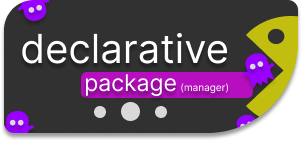

<h1 align="center">decpkg</h1>

<table>
  <tr>
    <td></td>
    <td>
      <strong>decpkg</strong> — <a href="https://www.python.org/">python</a>script 
      allows you to manage packages   
      declarative images following the.  
      declarative programming paradigm. 
    </td>
  </tr>
</table>

#### links

[~> Example](#example)  
[~> Dependencies](#Dependencies)  

---

## Dependencies

`python` — to start the interpreter  
`pyinstaller`— to create a binary file for better speed  

## Example

#### Ability to create a configuration directory and generate configs

https://github.com/user-attachments/assets/524b5196-dd3c-4f06-93d4-de58ad5b6020

> so I opened the terminal and wrote decpkg -g.
> to generate a configuration file
> and after the yes or no `(y/N)` prompt came up, I clicked on `n` because I already had the configuration file and then I just show you what it looks like.

#### Synchronization of current packages installation and uninstallation

##### Absolute Synchronization

https://github.com/user-attachments/assets/79f1afd8-f6ff-4694-b386-93250556e8a5

> **Note:** _Absolute_ mode is enabled, which means absolute synchronization.  
> During synchronization, all currently installed packages from the official  
> repositories (`pacman`) and the AUR are recorded into a `.history.json` file  
> located in the configuration directory. This list is stored as the _current state base_.  
> If during the next synchronization a package is **missing** from the configuration file  
> but **present** in the base, it will be **removed** from the system.  
> This enforces strict alignment between the system and the declared configuration.

##### Relative Synchronization

> **Note:** _Relative_ synchronization mode is also available.  
> In this mode, packages defined in the configuration will be **installed**,  
> but **removal** of packages must be done manually using standard tools,  
> such as `pacman -Rns <package>`.  
> This mode offers a more flexible and familiar workflow for users who prefer  
> to handle uninstalls themselves.
